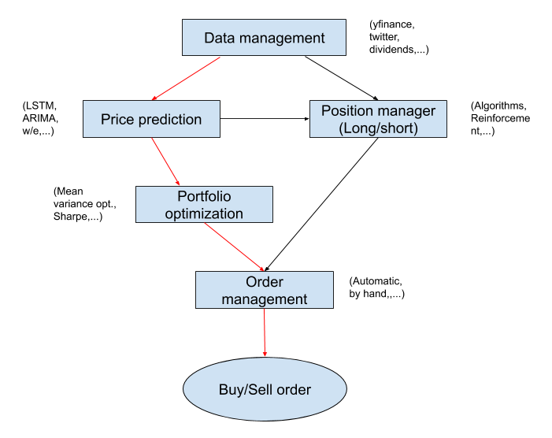

# Kompisfonden

Den mest extrema hedgefonden

```
https://github.com/ranaroussi/yfinance
```

Tickers:
 ```
 investexcel.net
 ```


 To make pyportfolioopt install if we use python 3.8 for example
 ```bash
sudo apt install python3.8-dev
sudo apt install libpython3.8-dev
 ```

------------------------------------------------------------------------
**Workflow**



Data management
- [x] Download ticker data

Price prediction
- [x] Simple LSTM

Position manager
- [] Working long/short position 

Portfolio optimization
- [x] Efficient frontier

Order management
- [] Create/test a account


